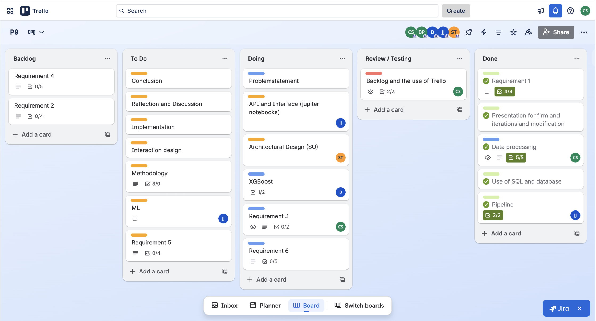

# Machine Learning Prediction Model

A sequence-based machine learning system developed to support intelligent data entry in PLM environments.

---

## Overview

This project was developed in collaboration with Bluestar PLM and focuses on how machine learning can support more efficient data entry in engineering-related systems.

The system predicts relevant values based on existing patterns in historical data, with the goal of reducing manual input and improving workflow efficiency.

Because the project was developed in collaboration with an external company, the repository focuses on methodology, system structure and development approach rather than the full production implementation.

---

## Problem Context

Engineering and PLM systems often require large amounts of manual and repetitive data entry.

This project explores how a machine learning-based solution can identify patterns in existing data and generate context-aware suggestions for the next relevant input.

---

## Project Goal

The goal of the system was to:

- Suggest relevant values based on previous inputs
- Reduce manual work in engineering systems
- Improve efficiency through data-driven recommendations
- Demonstrate how machine learning can support practical business workflows

---

## My Contribution

In this group project, I contributed to several core parts of the system.

### Data Preparation and Processing
- Worked on preprocessing and structuring the data
- Implemented label encoding for categorical variables
- Supported feature preparation for model input

### Machine Learning Pipeline
- Contributed to the development of the prediction pipeline
- Worked with XGBoost integration
- Helped structure the sequence-based recommendation logic

### Communication and Visualization
- Contributed to visualization of results
- Helped communicate findings and system value in a way that was understandable for external stakeholders

---

## Machine Learning Pipeline

The project followed a structured pipeline:

1. Data loading and filtering
2. Data preprocessing
3. Label encoding
4. Feature transformation
5. Model training using XGBoost
6. Prediction and recommendation

The final step uses sequence-based logic to recommend the next most relevant value based on previous selections.

---

## Technologies

* Python
* XGBoost
* Pandas
* NumPy
* Data preprocessing
* Feature engineering

---

## Pipeline & System Overview

### Machine Learning Pipeline

### Development Process

### User Stories

---

## Results

The project demonstrated how machine learning can be applied to support structured data entry and more efficient workflows in a PLM-related context.

It also showed how technical solutions can be developed iteratively in collaboration with an external company and adapted to real-world requirements.

---

## Future Work

- Improve model performance
- Expand feature engineering
- Automate more of the pipeline
- Explore broader integration in real workflows

---

## Notes

Due to NDA restrictions, the dataset and full implementation cannot be shared.

This repository focuses on methodology, architecture and development process rather than confidential data and company-specific details.

---

## Purpose

The purpose of the project was to explore how machine learning and data preprocessing can be translated into a practical support tool for real-world engineering workflows.

---
